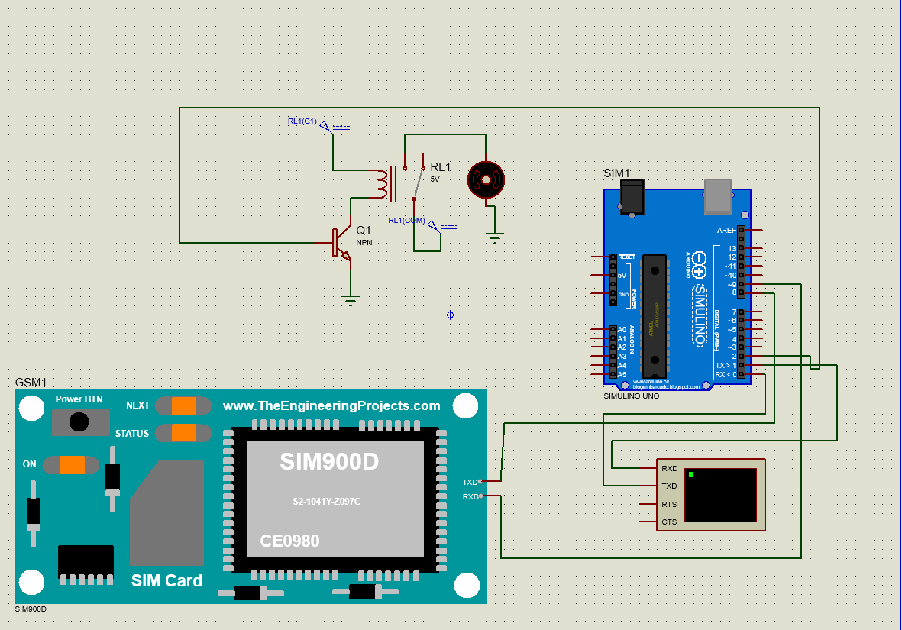
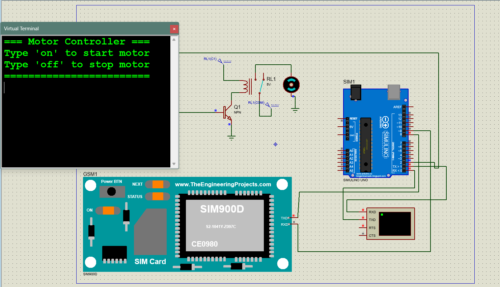
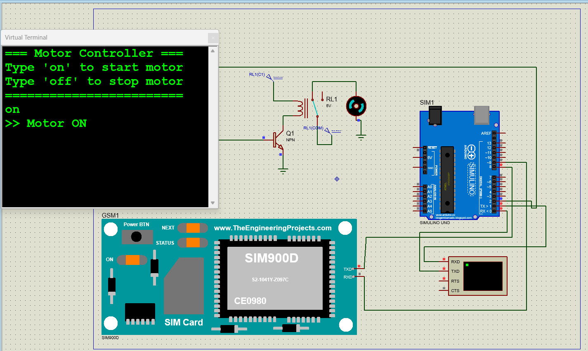
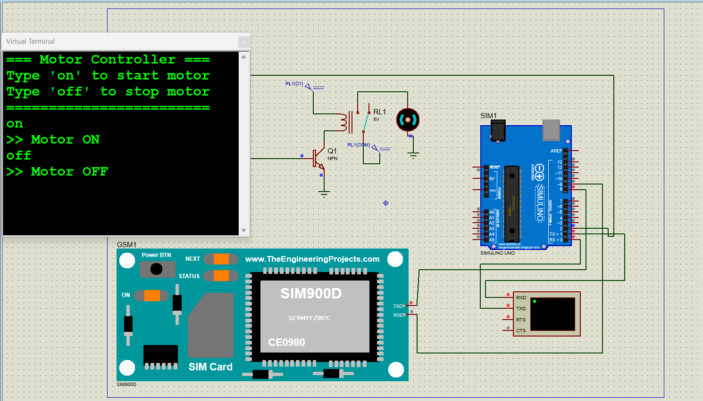
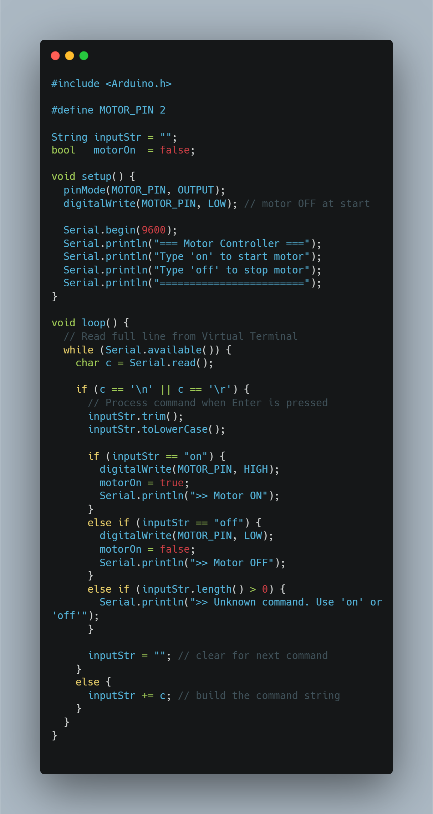

# GSM-Based Smart Pump Control System

This project demonstrates a simple smart pump control system implemented using an **Arduino Uno**, a relay driver circuit, and a DC motor (pump) in Proteus.

The motor can be controlled through serial commands sent from the Proteus Virtual Terminal.

---

## Features

- Turn the pump ON remotely.
- Turn the pump OFF remotely.
- Relay-based motor switching.
- Serial terminal command interface.
- Proteus simulation ready.

---

## Components Used

- Arduino Uno
- Relay Module
- NPN Transistor
- 1 kΩ Base Resistor
- DC Motor (Pump)
- 12V Power Supply
- Proteus Virtual Terminal

---

## Hardware Connections

| Component            | Connection                                          |
| -------------------- | --------------------------------------------------- |
| Arduino Pin 2        | Relay driver transistor base (through 1kΩ resistor) |
| Transistor Emitter   | GND                                                 |
| Transistor Collector | Relay Coil                                          |
| Relay Coil           | +5V                                                 |
| Relay COM            | +12V Supply                                         |
| Relay NO             | Motor Positive (+)                                  |
| Motor Negative (-)   | GND                                                 |
| Virtual Terminal TXD | Arduino RX0 (Pin 0)                                 |
| Virtual Terminal RXD | Arduino TX0 (Pin 1)                                 |

---

## Serial Commands

### Start Pump

```text
on
```

Output:

```text
>> Motor ON
```

### Stop Pump

```text
off
```

Output:

```text
>> Motor OFF
```

---

## Program Flow

1. System starts with the motor OFF.
2. User enters commands through the Virtual Terminal.
3. Arduino reads the command.
4. Relay switches the motor ON or OFF.
5. Status messages are displayed on the terminal.

---

## Source Code

```text
Arduino/Motor_Terminal_Control.ino
```

---

## Proteus Files

```text
Proteus/GSM-BasedSmartPumpControlSys.pdsprj
Proteus/Motor_Terminal_Control.hex
```

---

# Screenshots

## Circuit Design



## Default Mode



## Pump ON



## Pump OFF



## Full Source Code



---

## Example Terminal Output

```text
=== Motor Controller ===
Type 'on' to start motor
Type 'off' to stop motor
========================

on
>> Motor ON

off
>> Motor OFF
```

---

# ✍️ Author

**Samer Alaa Abu Zaina**  
Computer Engineer | Flutter Developer

Profiles Links:
[GitHub Profile](https://github.com/SamerZaina) | [LinkeIn Profile](https://www.linkedin.com/in/samerabuzaina/) | [X Profile](https://x.com/SamerAbuZaina)

---
